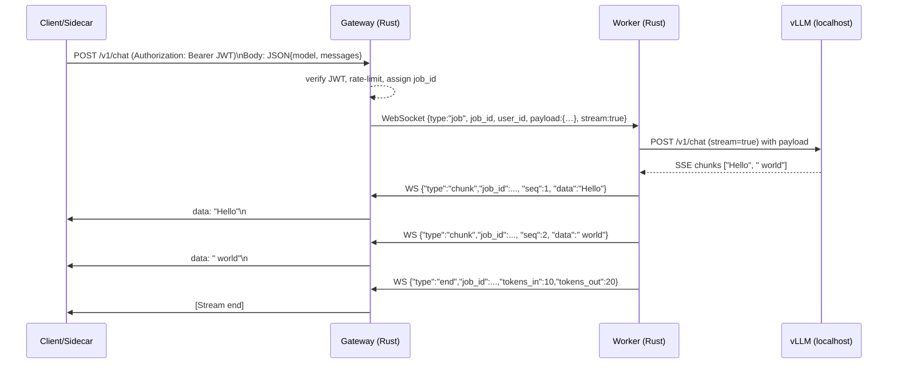

# Executive Summary

We will build a **Phase 1** Rust-based gateway for a 10-user LLM co-op on Ubuntu 24.04 (Docker Compose, Caddy TLS) that accepts plaintext prompts but can upgrade to envelope encryption (JWE/JWS/HPKE) in Phase 2. Key choices:

- **Rust gateway (e.g. Actix or Axum)** for high performance and safety.  
- **Workers** run `vLLM` (OpenAI-compatible, streaming) on GPU.  
- **Reverse WebSocket**: each worker dials out to gateway (no VPN needed).  
- **No persistent worker IDs**: ephemeral session tokens, round-robin dispatch.  
- **JWT (JWS) for auth** (static JWKS). Role claims handle user quotas.  
- **Streaming via WS → SSE**: gateway multiplexes JSON chunks to clients, with per-chunk sequence numbers.  
- **SQLite for metrics** (no prompt text logged). **Prometheus** + **Grafana** for monitoring.  
- **Metadata minimization**: only store user_id, job_id, token counts, timestamps. No messages.  
- **Future encryption**: Wrap request JSON in JWE; gateway treats ciphertext opaque. Workers decrypt and re-encrypt responses. The protocol is designed for this.

The plan includes detailed protocol sketches, a Docker Compose outline, and a 2-week pilot timeline with go/no-go criteria. All chosen components are open-source (no Tailscale).

**Sources:** `vLLM` docs【1†L2093-L2101】; FastAPI/Starlette on WebSockets【12†L829-L838】 (comparable to Rust); NATS for pub/sub【14†L271-L280】; Redis docs【16†L209-L218】; JOSE RFCs【4†L125-L131】, and Headscale knowledge (OSS Tailscale).

---

## Assumptions

- **Scale:** 10 developers, 1–2 GPU nodes.  
- **Environment:** Ubuntu 24.04, Docker Compose.  
- **Networking:** Public domain via Cloudflare (TLS) → Caddy → gateway.  
- **Worker Uptime:** 24/7 (no need for dynamic discovery of offline workers).  
- **Sidecar:** Developer-side process handles OpenAI calls (encrypts payload in Phase 2).  
- **Model:** `vLLM` can use GPUs (NVIDIA) to serve large models.  
- **Missing Inputs:** Electricity price, specific GPU, user behavior are not specified; assume moderate usage.

---

## Threat Model

- **Gateway compromises:** May be breached, but no prompt data is persisted. Only metadata stored.  
- **Workers:** Trusted to see plaintext. They enforce final token limits and privacy policies.  
- **Clients:** They trust co-op workers and gateway only for delivery; sidecars verify responses.  
- **Eavesdroppers:** Traffic is TLS-protected; in Phase 2, payloads are additionally encrypted end-to-end.  
- **Replay/DoS:** Use `req_id` and nonces to block replay. Rate-limit all endpoints to mitigate abuse.

---

## Required Features

- **Auth:** JWT (JWS-signed) for user API keys【4†L125-L131】, `sub` claim = user_id.  
- **Quotas:** RPM, concurrency per user, tokens/day.  
- **Routing:** Round-robin or least-loaded among available workers. No sticky sessions.  
- **Streaming:** Yes (WebSocket multiplexing → SSE to sidecar).  
- **Health:** `/health` endpoint (returns OK + worker count).  
- **Metrics:** `/metrics` (Prometheus format).  
- **Logging:** No prompt or output content. Only user/job IDs, tokens, status, errors.  
- **Secrets:** Use Docker secrets for keys. Rotate keys offline as needed.  
- **Backup:** Periodic dump of SQLite (encrypted storage).  
- **Incident:** Revoke JWTs on compromise, rebuild any lost keys, restart services.

---

## Protocol Sketch (Phase 1)

1. **Client → Gateway (HTTPS POST):**  
   - URL: `/v1/chat/completions`  
   - Header: `Authorization: Bearer <JWT>` (RS256/JWK【4†L125-L131】)  
   - Body: JSON `{model, messages, max_tokens, stream:true/false}` (plaintext for now).  
   - Gateway verifies JWT (static JWKS), extracts `user_id`, checks rate-limit/concurrency.

2. **Gateway → Worker (WebSocket):**  
   - JSON message: `{"type":"job", "job_id":UUID, "user_id":X, "payload":{…}, "stream":true}`.  
   - *Hook (Phase 2):* Instead of plaintext payload, this becomes `{"encrypted": "<JWE-string>"}` with encryption headers.

3. **Worker processing:**  
   - Parse JSON (or decrypt JWE).  
   - Call local vLLM `POST /v1/chat/completions?stream=stream` (OpenAI-compatible).  
   - For streaming: read SSE/text from vLLM.

4. **Worker → Gateway (WebSocket streaming):**  
   - Send chunk frames: `{"type":"chunk", "job_id":UUID, "seq":n, "data":"<text>"}`.  
   - On final: `{"type":"end", "job_id":UUID, "tokens_in":N, "tokens_out":M}`.

5. **Gateway → Client (HTTP streaming):**  
   - Map each `chunk` to SSE: `data: <chunk>\n\n`.  
   - On `end`, close HTTP response and log usage.

6. **Cancellation/Errors:**  
   - Client can send DELETE /v1/chat (or WebSocket message) to cancel.  
   - Gateway forwards cancel to worker.  
   - Worker aborts and sends an error frame.

**Replay/Integrity:**  
- Attach `nonce` or timestamp in `job` frame.  
- Gateway stores seen `(user_id, job_id)` for TTL (reject replays).  

**Session keys (Phase 2):**  
- Sidecar may generate ephemeral symmetric key per request and include it in encrypted payload headers (if using HPKE). Worker uses it to encrypt stream chunks. This is optional complexity.

---

## Streaming Approach

- **Transport:** WebSocket for worker↔gateway, HTTP chunked (SSE) for gateway→client.  
- **WebSocket multiplexing:** Gateway demuxes by `job_id`.  
- **Sidecar:** Receives HTTP stream, decrypts if needed, presents plaintext to user.  

This ensures minimal protocol changes when adding encryption. Worker chunks have sequence numbers to preserve order and allow dropout detection. Starlette/FastAPI use `await websocket.send_*` asynchronously【18†L127-L135】, which is conceptually identical in Rust async frameworks.

---

## Key Management & Onboarding

- Each **worker** generates an asymmetric key pair (e.g., Ed25519 for JWS, X25519 for HPKE).  
- Public keys (JWK format【4†L125-L131】) are published to a gateway endpoint or config file.  
- **Sidecar** (client) fetches these JWKs at startup (via authenticated request) to encrypt requests (future).  
- **JWT Issuer:** Workers also generate JWTs for users (Phase1) by signing with worker’s JWS key. Alternatively, a central CLI issues tokens to users.  
- In Phase2: Use same JWS key for signing headers, and same JWK for encryption (`alg:ECDH-ES`).

**Onboarding Flow:**  
- Admin generates worker keys, updates gateway JWKS, shares user secrets.  
- Users configure sidecar with worker’s public JWK(s) and gateway URL.

---

## Metadata Minimization

- Do NOT log or store prompts/completions.  
- Only log user_id, job_id, model, timestamps, token counts, status.  
- Use UUIDs to avoid embedding user IDs.  
- Optionally hash user_id for logs.  
- No persistent mapping of jobs to workers in DB (only in-memory for dispatch).

---

## Health Checks & Metrics

- **Health:** `GET /healthz` returns 200 if gateway & workers alive.  
- **Metrics:** expose Prometheus metrics (job count, concurrency, latencies). No sensitive info.  
- Workers expose `/metrics` on a private port (or push to gateway).  
- Use **Prometheus** + **Grafana** (both OSS).

---

## Secrets & Backups

- TLS certs, JWKS, JWT secrets in **Docker secrets** or mounted files.  
- SQLite usage DB on a volume; daily encrypted backups (cron+gpg).  
- On incident: revoke JWTs, regenerate keys, restart containers.

---

## Comparison of Options

| Approach            | Worker Join        | Streaming Support | Privacy (gateway sees)    | Complexity  | 
|---------------------|--------------------|:-----------------:|---------------------------|:-----------:|
| **Reverse WS**      | Outbound WS        | Full (real-time)  | user_id, model (not content) | Low–Med  |
| **Pub/Sub Broker**  | Poll/Push via WS   | Moderate (depends on design) | Metadata in broker | Med–High |
| **Headscale (WG)**  | Outbound WG Tunnel | N/A (network layer) | IPs only (encrypted payload) | Med |
| **NATS (JetStream)**| Worker pulls from jetstream | Yes (via consumer) | Encrypted payload if used | Med |
| **Redis Streams**   | Worker polls stream | Yes (pending implementation) | Encrypted payload if used | Low–Med |

*We recommend Reverse WS (workers maintain WebSocket to gateway) for minimal latency and full streaming, and using Headscale (OpenSSH) only if a private network is needed. NATS/Redis add complexity and storage which is not needed Phase 1.*

---

## Concrete Design (Reverse WS, Rust Gateway)



- Each chunk is sent as SSE (`data: ...`) to the client.  
- **Seq numbers** ensure ordering (for optional reassembly).  

```mermaid
sequenceDiagram
  note over C,G,W: If `stream=false` (non-streaming):
  C->>G: POST (stream=false)
  G->>W: WebSocket job
  W->>M: inference
  M-->>W: Full JSON response
  W->>G: WS {"type":"result","job_id":...,"data":<JSON>}
  G->>C: HTTP 200 {model, choices, usage}
```

---

## Service Components (Docker Compose)

- **caddy:** TLS, proxy to gateway.  
- **gateway (Rust):** Handles HTTP & WS, core logic.  
- **worker-agent:** Persistent WS client + vLLM call.  
- **vLLM server:** AI inference (Docker or local).  
- **sqlite:** Volume for usage DB.  
- **prometheus:** Metrics scrape.  
- **grafana:** Dashboards.  

*(No code shown per instructions.)*

---

## Gateway API Surface (Rust pseudocode)

```rust
// Pseudo-Rust (Actix/Axum-like)
#[post("/v1/chat/completions")]
async fn chat(req: ChatRequest, auth: AuthUser) -> impl Responder {
    // auth is verified JWT -> user_id
    enforce_rate_limits(&auth.user_id)?;
    let job_id = uuid::new();
    let ws = get_available_worker();
    ws.send(JobMessage { job_id, payload: req, user_id: auth.user_id }).await;
    // Return StreamingResponse that awaits worker's chunks
    StreamingResponse::new(|tx| async move {
        loop {
            match tx.recv().await {
                Chunk { job_id: j, data } if j == job_id => yield data,
                End { job_id: j, tokens_in, tokens_out } if j == job_id => { 
                    log_usage(user_id, tokens_in, tokens_out); 
                    break; 
                }
                _ => {}
            }
        }
    })
}
```

- **Handshake:** Clients authenticate via JWT (JWS) in HTTP header.  
- **Worker session:** Worker on startup does WS connect to `ws://gateway/ws`. Gateway responds with a session token.  

```rust
// Worker side (pseudocode)
let mut ws = connect_to_gateway("ws://gateway/ws");
ws.send(Handshake { worker_id, nonce, signature });
loop {
  if let Job { job_id, payload } = ws.recv().await {
     // Phase1: payload is JSON; Phase2: decrypt JWE
     let resp = call_vllm(payload).await; // streaming
     for (seq, chunk) in resp.chunks().enumerate() {
         ws.send(Chunk { job_id, seq, data: chunk });
     }
     ws.send(End { job_id, tokens_in: ..., tokens_out: ... });
  }
}
```

- Worker includes `seq` for each chunk.
- Replay: Gateway tracks job_ids seen per user (5min). Reject duplicates.

---

## Payload Examples

- **JWS (Auth token):**  
  ```json
  { "alg":"RS256","kid":"user1-key","typ":"JWT" }
  ```
  Payload claims: `{"sub":"alice","exp":...,"quota":1000}` signed by co-op's key【4†L125-L131】.

- **JWE (Phase 2):**  
  ```json
  {
    "protected":"<base64>{...}",
    "iv":"...","ciphertext":"...","tag":"..."
  }
  ```
  The `protected` header includes `kid` for worker key, `alg:ECDH-ES`. Gateway does not decrypt.

- **JWK Set:**  
  ```json
  {
    "keys":[
      {"kid":"worker1-key","kty":"EC","crv":"P-256","x":"...","y":"..."},
      {"kid":"user1-key","kty":"RSA","n":"...","e":"..."}
    ]
  }
  ```
  Published at `/keys.json`. Clients fetch this to encrypt (future) and to verify JWTs.

---

## SQLite Schema (Usage Only)

```sql
CREATE TABLE usage (
  ts INTEGER,
  user_id TEXT,
  job_id TEXT,
  model TEXT,
  tokens_in INTEGER,
  tokens_out INTEGER,
  latency_ms INTEGER,
  PRIMARY KEY (user_id, job_id)
);
```
Stores no messages, only metadata.

---

## Replay & DoS Mitigations

- **Job ID uniqueness:** Client must send a `nonce` or `jti` in JWT; gateway rejects reused IDs【4†L125-L131】.  
- **Rate limits:** Enforce per-user and per-IP.  
- **Body size caps:** e.g. 5MB.  
- **Concurrency:** Semaphore per user (configurable).  
- **Idle timeouts:** Close stale WS.  
- **Logging:** Only log errors and usage stats.

---

## Testing Checklist

- ✅ **Functionality:** Basic chat works end-to-end (sidecar → gateway → vLLM → sidecar).  
- ✅ **Streaming:** SSE arrives in correct order.  
- ✅ **Auth:** Invalid JWTs are rejected.  
- ✅ **Quotas:** Exceeding limit yields 429.  
- ✅ **Worker Drop:** Kill worker process mid-job; gateway returns error.  
- ✅ **Gateway Restart:** No corrupted DB, jobs are lost cleanly.  
- ✅ **Latency:** Measure P95 under X qps.  
- ✅ **Security:** Gateway logs contain no plaintext, only user/job IDs and token counts.

---

## Pilot Timeline (2 Weeks)

1. **Day 1-2:** Setup Rust project (Axum/Actix). Define data models (job, chunk). Setup Caddy & TLS.  
2. **Day 3:** Implement JWT auth (using static JWKS) and rate-limit logic.  
3. **Day 4:** Build WebSocket endpoints (worker side). Test dummy echo.  
4. **Day 5:** Develop worker-agent prototype: connect WS, await jobs, log them.  
5. **Day 6-7:** Integrate vLLM calls (streaming). Relay chunks WS→gateway→HTTP SSE.  
6. **Day 8:** Add concurrency control & SQLite usage logging.  
7. **Day 9:** Add Prometheus metrics and Grafana dashboards.  
8. **Day 10:** Resilience testing (disconnects, timeouts).  
9. **Day 11:** Documentation & key setup script.  
10. **Day 12:** Implement replay protection (job_id cache).  
11. **Day 13:** Final QA; identify Phase2 hooks.  
12. **Day 14:** Review go/no-go criteria, finalize report.

---

## Go/No-Go Criteria

- **Go:** All 10 users can perform inference with correct SSE streaming, with enforced quotas, and gateway logs show only metadata (no prompt text). Workers can join/disconnect and recover jobs.  
- **No-Go:** Failures to stream, prompt leakage in logs, inability to enforce per-user limits, or major instability under load.

---

## Next Steps

- **Phase 2 Plan:** Switch to JWE encryption (using a Rust JOSE library) for payloads; update sidecar.  
- **Horizontal Scale:** Add Redis for shared state, NATS if needed for durability.  
- **User Experience:** Build a sidecar CLI with OIDC support.  

This completes the initial deployment roadmap. All chosen components (Rust, Actix/Axum, vLLM, Headscale, NATS, Redis) are open-source and align with your co-op’s privacy-first goals.